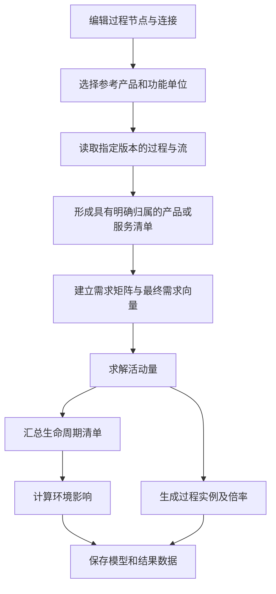

# Model 建模与计算说明

Model 用过程和连接描述产品的供应链，以功能单位确定研究对象和规模，再求出各项活动的需求量、生命周期清单与环境影响。本说明围绕产品需求驱动的建模语义，解释这些对象如何共同构成一次计算。

## 1. 模型中的基本对象

| 对象 | 含义 | 示例 |
| --- | --- | --- |
| Flow（流） | 一种具有确定身份、版本和计量属性的交换对象 | 氨、电力、二氧化碳 |
| Process（过程） | 在一个参考规模下发生的投入与产出清单 | 生产 100 kg 产品所用的原料、能源及产生的排放 |
| 过程实例 | 某份 Process 在一个 Model 中的一次使用 | 两个装置节点引用同一份电力过程数据 |
| Exchange（交换） | 过程中的一项输入或输出 | 输入 50 kg 原料、输出 100 kg 产品 |
| 连接 | 某项下游输入的供应来源 | 合成氨过程的氨输出供应下游过程的氨输入 |
| 定量参考 | 用于定义过程规模的产品或处理服务 | 产品输出 100 kg，或废物处理输入 1 kg |
| 功能单位 | 本次研究所服务的功能及其数量 | 提供 1 t 指定质量的产品 |
| 活动量 | 为满足功能单位，需要调用的计算活动数量 | 使用 10000 kg 产品对应的生产清单 |

过程、流以及它们的引用都携带版本。相同过程的不同实例分别参与计算；流的身份、版本和计量属性共同确定连接两端的数量含义。

## 2. 过程清单中的数量

过程数量描述一组相互对应的投入与产出。假设一份清单记录：

| 交换     |   数量 |
| -------- | -----: |
| 产品输出 | 100 kg |
| 原料输入 |  50 kg |
| 排放输出 |  20 kg |

这份清单表示生产 100 kg 产品对应原料投入 50 kg、排放 20 kg。若研究需要 10000 kg 产品，过程倍率为：

```text
过程倍率 = 所需产品量 / 清单参考产品量
         = 10000 / 100
         = 100
```

相应的原料投入为 5000 kg，排放为 2000 kg。参考产品量是整份清单的计量基准；库存、设备产能和开工计划属于生产调度的建模参数。

下游输入同样是其过程参考规模下的数量。下游过程的实际投入量还要乘以该下游过程的活动倍率。

## 3. 连接与需求

连接回答“这项输入由哪个过程的哪种产品提供”。交换清单回答“完成一单位下游活动需要多少输入”。

例如，下游过程每生产 1 kg 成品，需要 2 kg 氨。当功能单位要求 500 kg 成品时，氨需求为 1000 kg。若氨供应过程的参考产出是 100 kg，供应过程倍率为 10。

同一产品可以供应多个下游，需求按量相加：

```text
供应过程需要提供的产品量
  = 下游甲的产品需求量
  + 下游乙的产品需求量
  + 该产品直接承担的最终需求量
```

这里的供应量是经过计算缩放的量。连接两端填写各自过程清单中的数量，计算器通过活动倍率完成换算。一项输入在计算图中对应一个明确供应者；同一供应者的一个产品输出可以连接多个消费者。

## 4. 功能单位与系统边界

功能单位把模型中的研究目标转换为最终需求。参考过程、参考交换和目标数量共同确定需求向量。

最终需求是研究对象直接需要的产品或服务。中间需求由供应链上的过程投入产生。例如，以 500 kg 成品为目标时，成品是最终需求；生产成品所需的氨、电力和运输是中间需求。

连接将交换纳入模型内部的供应关系。未连接的交换构成模型边界上的投入或产出。边界产品输入表示模型从外部系统取得的产品；基本流表示环境与技术系统之间的交换。废物流及其处理连接描述废物进入处理过程的路径。

参考交换为输入的处理过程，以接收并处理指定数量的物料或废物定义功能单位。其排放、资源消耗及回收产品按处理服务的规模进入清单。

## 5. 多产品过程与分配

一个过程可以同时提供多种产品。产品分配描述各产品承担哪些投入和排放，以及承担多少。

分配比例来自过程数据所采用的方法，例如质量、经济价值或物理因果关系。比例可以对所有适用交换相同，也可以按交换分别给定。产品角色由流类型、定量参考和分配目标共同确定；基本流与废物交换按各自的环境或处理含义进入模型。

设过程的产品 `p` 参考产量为 `q_p`，某项投入或排放 `e` 的数量为 `b_e`，分给产品 `p` 的比例为 `α_e,p`，则每单位产品承担的交换量为：

```text
单位产品 p 的交换量 = b_e × α_e,p / q_p
```

比例使用小数表示，例如 80% 对应 0.8。对采用完整分配的交换，各产品的分配比例合计为 1。

旧式统一分配在各产品输出上记录份额。已声明的份额合计为 100% 时，未声明的非参考产品份额为 0。例如 P、Q 各占 50%，已连接的第三个非参考产品 R 未填写份额，则 R 的单位产品清单只保留自身产出，其他投入与排放的归属量为 0；显式填写 R=0% 得到相同清单。输出定量参考没有声明份额时，需要明确其产品归属。

标准目标分配按每项交换分别解释。已经声明的分配向量必须合计为 100%；向量中未列出的产品份额为 0。例如某项排放只列出 P=100%，Q 对这项排放承担的份额为 0，与显式写出 P=100%、Q=0% 相同。Q 可以在另一项交换中承担非零份额。

在采用标准目标分配的过程中，完全没有分配声明的交换整体归属于过程的定量参考产品，其他产品对该交换的份额为 0。若整个过程没有分配声明，则计算清单只支持其定量参考；连接非参考联产品需要由过程数据给出分配解释。

每份分配后的产品清单以该产品为参考产出，包含归属于它的投入、排放和处理义务。联产品的参考产出分别进入各自的产品清单。已经具有确定产品归属的清单，按其现有交换量参与需求计算。

### 一个完整示例

假设过程同时产出产品 P 和 Q，原料投入及排放均按 80% 和 20% 分配：

| 交换         | 原始过程数量 |
| ------------ | -----------: |
| 产品 P 输出  |       100 kg |
| 产品 Q 输出  |        20 kg |
| 原料输入     |        50 kg |
| 二氧化碳排放 |       100 kg |

相应的单位产品清单为：

| 产品清单 | 参考产出 | 原料投入 | 二氧化碳排放 |
| -------- | -------: | -------: | -----------: |
| P        |   1 kg P |   0.4 kg |       0.8 kg |
| Q        |   1 kg Q |   0.5 kg |         1 kg |

两种产品根据各自需求调用：

| P 的需求 | Q 的需求 | 原料合计 | 二氧化碳排放合计 |
| -------: | -------: | -------: | ---------------: |
|   100 kg |    10 kg |    45 kg |            90 kg |
|   100 kg |    20 kg |    50 kg |           100 kg |
|   100 kg |    30 kg |    55 kg |           110 kg |

这些结果表示研究所需产品承担的生命周期清单。产品清单的调用量表达归属需求，装置在物理运行中同时产出多种产品的关系体现在原始过程数据中。

多功能性还可以通过过程细分、系统扩展等方法处理。所选方法决定用于计算的过程清单；本说明中的产品独立需求方程建立在产品清单已经具有明确归属的基础上。

## 6. 从需求到活动量

计算图以具有明确参考产品或服务的清单作为活动。产品活动按参考产出归一化后，每单位活动提供 1 单位该产品。

用 `x_i` 表示活动 `i` 的数量，用 `a_ij` 表示活动 `j` 每单位所需的活动 `i` 产品数量，用 `y_i` 表示产品 `i` 的最终需求，则：

```text
x_i = Σ_j(a_ij × x_j) + y_i
```

所有活动一起组成：

```text
x = A x + y
(I − A) x = y
```

`A` 的每一列描述一个活动的供应需求，`y` 描述功能单位，`x` 是求解得到的活动量。连接两端使用相同流版本下的计量基准，交换数量在构造系数时按产品参考量归一化。

对于包含循环的模型，循环中的活动一起求解。例如，每生产 1 单位产品需要回用 0.2 单位同类产品，最终需求为 1，则：

```text
x = 0.2 x + 1
x = 1.25
```

总生产量为 1.25，内部消耗为 0.25，最终交付为 1。活动量同时满足供应链投入和最终需求。

没有被本次功能单位需求到的活动，其本次活动量为零。对另外一种产品开展研究时，以它的功能单位构建相应需求向量。

## 7. 生命周期清单与环境影响

求得活动量后，将每个活动的单位清单乘以活动量并汇总。对于基本流系数矩阵 `B`，生命周期基本流清单为：

```text
g = B x
```

模型内部的产品交付与消费成对抵消，系统边界上的资源输入、排放、产品和废物流保留在结果中。汇总按照流的身份、版本、方向及适用计量属性进行。

LCIA 将基本流清单与选定影响评价方法的表征因子相乘。设 `C` 为表征因子矩阵，则影响结果为：

```text
h = C g
```

例如，某基本流排放为 20 kg，某影响类别的表征因子为每 kg 排放 3 单位影响，则该交换贡献 60 单位影响。评价结果同时记录方法版本、单位和因子覆盖情况，供结果解释使用。

## 8. 主结果与产品结果

主结果对应 Model 选定的功能单位。其他产品的结果以该产品在来源清单中的参考数量为目标，每份结果使用自己的需求向量求解。

多份结果可以引用同一上游过程。每份结果中的上游贡献，由该结果自身的产品需求决定。比较或汇总结果时，使用与研究目标一致的功能单位和系统边界。

结果 Process 记录该功能单位下汇总的投入与产出。分配后的单位过程记录一个产品活动的清单，结果 Process 记录一段供应链计算后的清单，两者分别承担供应建模和结果表达的职责。

## 9. 编辑、计算与保存

Model 的数据有三种相互关联的表达：

| 表达     | 内容                                           | 用途                         |
| -------- | ---------------------------------------------- | ---------------------------- |
| 编辑图   | 装置节点、原始过程引用、连接、布局、参考目标   | 建模和编辑                   |
| 计算图   | 具有明确产品归属的过程实例、供应连接、活动倍率 | 计算与标准数据交换           |
| 结果清单 | 功能单位下的汇总投入、产出和环境影响           | 查看、比较及作为过程数据使用 |

编辑图中的多产品节点按分配关系映射到计算图中的产品过程实例。分配后的过程通过原始过程版本、产品交换和分配方法建立来源关系。节点与计算实例的对应关系支持结果回溯。

标准模型中的 `processInstance` 引用相应的 Process 数据集。`@multiplicationFactor` 表示整份被引用清单的调用倍率。如果该清单参考产量为 `q`，本次产品活动量为 `x`，则：

```text
@multiplicationFactor = x / q
```

以 1 kg 产品为基准的清单，供应 100 kg 时倍率为 100；以 100 kg 产品为基准的清单，供应 100 kg 时倍率为 1。两种表达对应相同的实际交换量。

平台的 `json_tg.xflow` 承载编辑图。生命周期模型数据集承载标准计算图，结果 Process 承载汇总清单。数据包包含计算实例引用的过程及其依赖，接收方据此恢复供应关系和计算数量。

保存结果表示上一次成功计算的清单。重新计算需要明确当前所引用过程的产品归属。若非参考产品缺少分配，需在源过程中补全分配或选用已分配的产品过程；若旧式统一分配仅声明其他产品的份额，需明确参考产品的份额（可以为 0），并使所有产品份额合计为 100%。模型节点引用修复后的过程版本，再进行计算。

计算诊断显示涉及的过程与产品，并提供节点定位和对应的处理说明。计算失败时保持已保存的模型与结果；成功计算并保存后，结果才反映新的过程版本、需求和分配依据。

## 10. 计算流程



过程数据、分配方法、功能单位、供应关系和评价方法共同确定结果。它们的版本与引用使结果能够追溯到具体的建模依据。

## 参考资料

- [openLCA：多功能过程的分配与系统扩展](https://greendelta.github.io/openLCA2-manual/allocation.html)
- [ecoinvent：系统模型与产品清单](https://support.ecoinvent.org/system-models-1)
- [Brightway：技术系统矩阵、需求与清单计算](https://docs.brightway.dev/en/latest/content/overview/matrix.html)
- [计算代码参考](./util_calculate.md)
